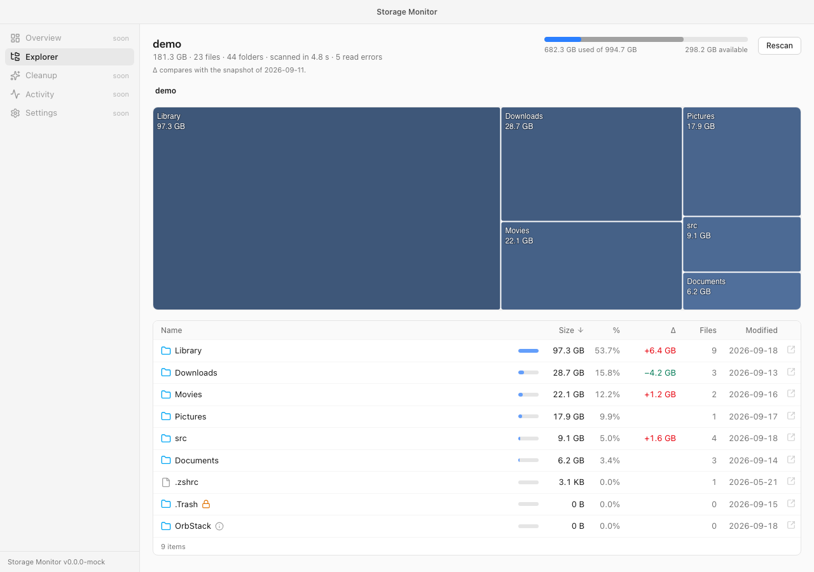
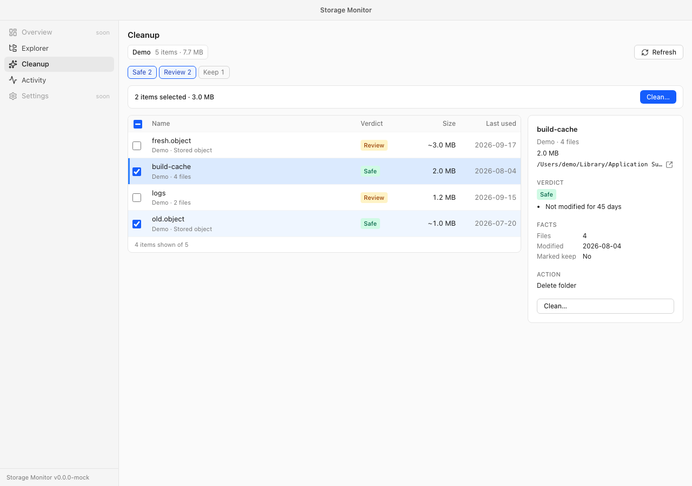
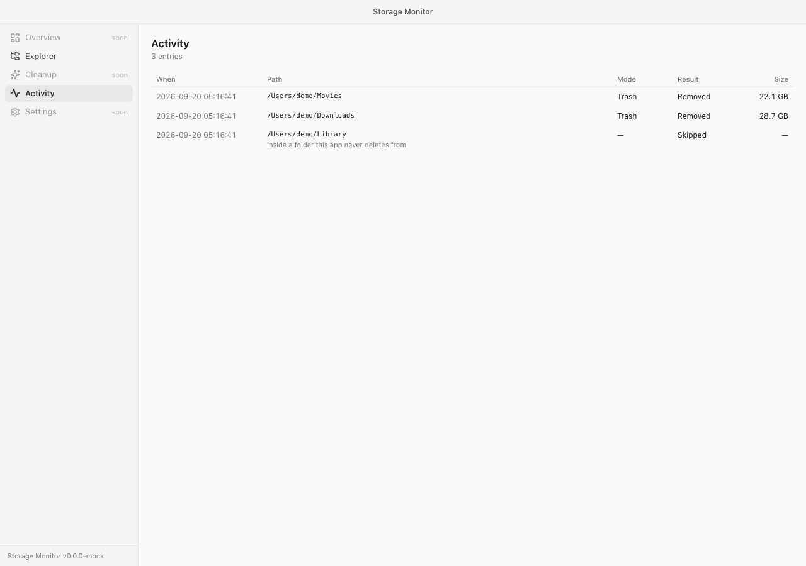

# Storage Monitor

[](https://github.com/vaital3000/storage-monitor/actions/workflows/ci.yml)

A macOS disk space analyzer that knows what your developer artifacts are and
can clean them up safely: git worktrees, Docker images and caches, Xcode
DerivedData and simulators.

Most analyzers answer "where is the space". Storage Monitor answers "what can I
free right now, and why", with a preview and a confirmation before anything is
touched. Deletion goes to the Trash by default.

> Status: pre-alpha. The scanner, snapshots with growth deltas, the Explorer and
> deletion from it are done, and so is the framework the cleanup modules plug
> into; the first real module, git worktrees, is next. See the
> [roadmap](docs/plans/2026-09-17-storage-monitor-design.md#14-roadmap).

## What it does today

- Scans the home folder in parallel: about 20 s for 4 million files on an
  Apple Silicon Mac. Sizes are allocated bytes, hard links are counted once,
  symlinks are never followed and the scan stays on one volume.
- Explorer screen: a treemap and a sortable table with size, share of the
  parent, growth since the previous scan, file count and modification date.
- Drill-down with breadcrumbs and the keyboard: Enter opens a folder, Backspace
  goes up, arrows move between rows.
- Folders that cannot be read (parts of `~/Library` need Full Disk Access) are
  reported with a lock, not silently skipped; a mount point is shown, not
  entered.
- Reveal in Finder from any row.
- Delete from the Explorer: tick rows (click, Space, Shift for a range) and a
  dialog previews the batch before anything is touched — every row with what
  will happen to it, and a reason for every row that is refused. The scan root,
  `~/Library` and the other denylisted paths, anything outside the scanned root
  and a path already covered by another are blocked there, not attempted.
- Two modes. **Move to the Trash** is the default and is recoverable; **Delete
  for good** is permanent and waits for an explicit "I understand that this
  cannot be undone" that a change of mode clears again.
- The tree is patched after a batch instead of rescanned, so the rows go, the
  parents shrink and the free space is re-read in a moment rather than in
  another full scan.
- Activity screen: what the app deleted, newest first — when, path, mode, result
  and size — from an append-only record that nothing prunes.
- A snapshot per scan, so the next scan shows what grew.
- Cleanup screen: what the cleanup modules found, with a verdict and its
  reasons for every item, filters by verdict and module, a detail panel with the
  facts, and batches through the same dialog — which lists the exact paths and
  commands, and asks for an acknowledgement for anything the Trash cannot undo,
  in either mode. Modules never delete anything themselves: they plan the steps,
  and the app runs them through the same guards as the Explorer
  ([ADR 0008](docs/adr/0008-modules-describe-the-core-acts.md)). A release build
  ships no module yet; a debug build ships a demo module to try the flow on.
- A CLI with the same scanner and JSON output for scripts.

## Screenshots







## CLI

```bash
storage-monitor scan --json --save | head
```

`scan` walks the home folder, or the folder given as an argument, and prints a
report; `--json` makes it machine-readable and `--save` stores a snapshot and
lists the folders that grew since the previous one. `--depth` (default 2) and
`--top` (default 20) bound the reported tree; `--threshold` (default 10 MiB) is
the smallest file kept in the snapshot.

`modules list` names the cleanup modules of the build and whether each can run
here; `modules run <id>` prints what one of them finds, with its verdicts. Both
only look, and both take `--json`.

## Install

Download the latest `.dmg` from
[Releases](https://github.com/vaital3000/storage-monitor/releases), open it and
drag the app to Applications. Requires macOS 13.3 or newer.

The app is not notarized yet. On first launch macOS will refuse to open it:
right-click the app, choose **Open**, and confirm. Alternatively:

```bash
xattr -d com.apple.quarantine "/Applications/Storage Monitor.app"
```

The same release contains `storage-monitor-cli-<version>-macos-universal.tar.gz`
with the command-line tool.

## Development

Prerequisites: Rust (stable), Node 22+, pnpm 10, [`just`](https://github.com/casey/just).

```bash
just setup   # install JS deps and the Playwright browser
just dev     # run the desktop app
just dev-web # run only the UI in a browser with a mocked backend
just ci      # lint, unit tests, frontend build and e2e; CI adds a macOS build smoke
```

Layout, conventions and the module contract are described in
[CLAUDE.md](CLAUDE.md) and [docs/](docs/); writing a cleanup module, in
[docs/modules](docs/modules/README.md). Design decisions live in
[docs/adr](docs/adr).

## Contributing

See [CONTRIBUTING.md](CONTRIBUTING.md). Issues and pull requests are welcome.

## License

[MIT](LICENSE)
